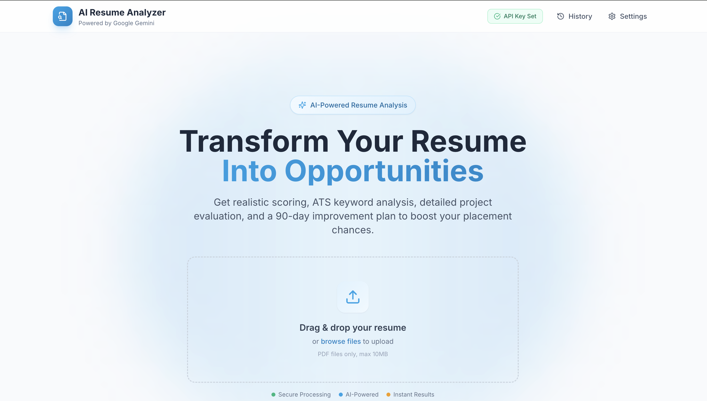
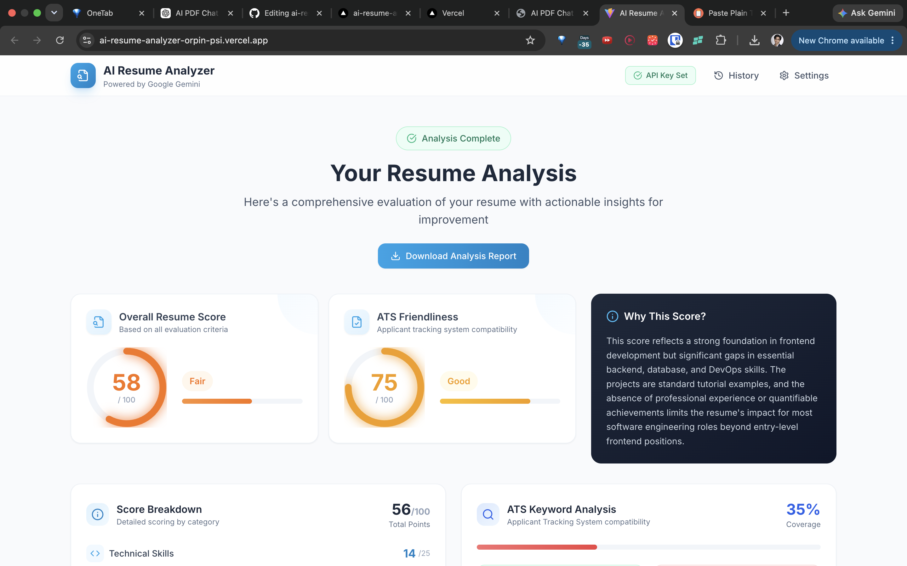
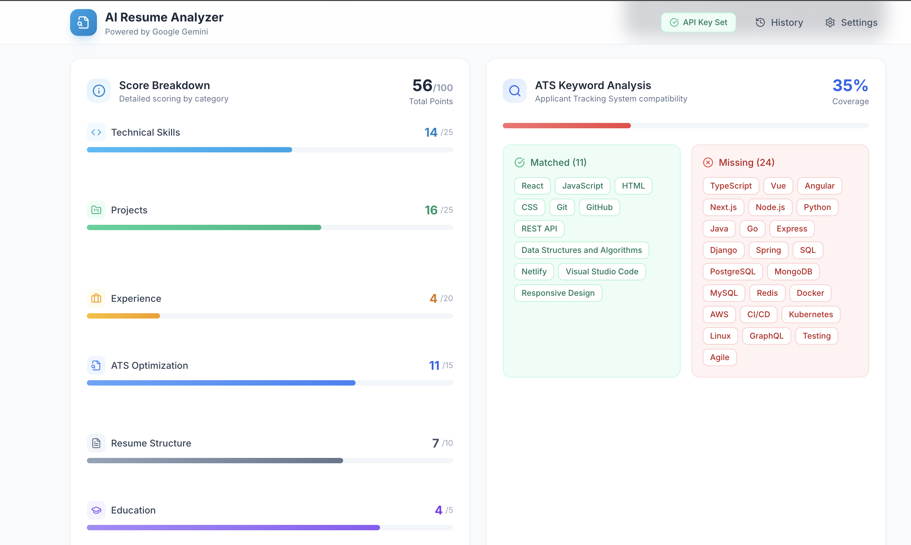

# AI Resume Analyzer

A production-quality, placement-ready AI-powered resume analyzer that provides realistic scoring, detailed feedback, and actionable improvement plans.

## Live Demo

[Open Live Demo](https://ai-resume-analyzer-orpin-psi.vercel.app/)

## GitHub Repository

[View Repository](https://github.com/irrshad7-droid/ai-resume-analyzer)

## Screenshots

### Home Page


### Analysis Dashboard


### ATS Analysis


## Features

### Core Analysis
- **Resume Upload**: Drag-and-drop or click to upload PDF resumes
- **AI-Powered Analysis**: Comprehensive evaluation using Google Gemini
- **PDF Report Export**: Download professional analysis reports

### Realistic Scoring System
- **6-Criteria Breakdown**:
  - Technical Skills (25 points)
  - Projects (25 points)
  - Experience (20 points)
  - ATS Optimization (15 points)
  - Resume Structure (10 points)
  - Education (5 points)
- Transparent explanations for each score
- Scores above 85 are rare and require exceptional content
- Honest assessment - no inflated results

### ATS Keyword Analysis
- Matched keywords display
- Missing keywords detection
- Keyword coverage percentage
- Industry-standard keyword list

### Interview Readiness
- Frontend readiness estimate
- Backend readiness estimate
- Full-stack readiness estimate
- Internship readiness estimate
- Weighted overall score

### Project Evaluation
For each project detected:
- Overall project score
- Complexity Score (0-100)
- Resume Value (0-100)
- Recruiter Interest (0-100)
- What's good, weak, and how to improve

### 90-Day Improvement Roadmap
- Week 1-4: Foundation Strengthening
- Week 5-8: Skill Building
- Week 9-12: Portfolio Polish
- Personalized tasks based on detected gaps

### Red Flag Detection
Identifies recruiter concerns:
- Missing internship experience
- Weak project descriptions
- Lack of quantifiable achievements
- Missing portfolio/GitHub
- Future project dates
- Severity ratings (high/medium/low)

### Analysis History
- Store up to 10 previous analyses
- View and compare past results
- Delete individual analyses
- Clear all history option

## Tech Stack

- **React 19** - Modern UI library with hooks
- **TypeScript** - Type-safe development
- **Vite** - Fast build tool and dev server
- **Tailwind CSS** - Utility-first styling
- **PDF.js** - PDF text extraction
- **Google Gemini API** - AI analysis (key stored in browser)
- **jsPDF** - PDF report generation
- **Lucide React** - Beautiful icons
- **react-dropzone** - File upload handling

## Architecture

```
User Uploads Resume
        ↓
PDF.js Extracts Text
        ↓
Gemini API Analysis (Strict Prompt)
        ↓
Structured JSON Response
        ↓
Dashboard Visualization
        ↓
PDF Export / History Storage
```

## Project Structure

```
src/
├── components/
│   ├── AnalysisDashboard.tsx   # Main results display
│   ├── ScoreBreakdown.tsx      # 6-criteria score cards
│   ├── ATSKeywords.tsx         # Keyword analysis
│   ├── InterviewReadiness.tsx  # Role readiness scores
│   ├── RedFlags.tsx            # Recruiter concerns
│   ├── Roadmap.tsx             # 90-day improvement plan
│   ├── ProjectCard.tsx         # Project evaluation
│   ├── ScoreCard.tsx           # Circular score gauges
│   ├── FeedbackSection.tsx     # Strengths/weaknesses
│   ├── FileUpload.tsx          # Dropzone component
│   ├── SettingsModal.tsx      # API key management
│   ├── AnalysisHistory.tsx     # History viewer
│   └── Header.tsx              # Navigation
├── hooks/
│   └── useResumeProcessor.ts   # Resume processing state
├── services/
│   ├── gemini.ts               # AI integration + prompt
│   ├── pdfExtractor.ts         # PDF text extraction
│   └── pdfExport.ts            # PDF report generation
├── types/
│   └── index.ts                # TypeScript interfaces
├── utils/
│   └── formatting.ts           # Score formatting
└── App.tsx                     # Main application
```

## Getting Started

### Prerequisites

- Node.js 18+
- npm or yarn

### Installation

1. Clone the repository:
   ```bash
   git clone https://github.com/yourusername/ai-resume-analyzer.git
   cd ai-resume-analyzer
   ```

2. Install dependencies:
   ```bash
   npm install
   ```

3. Start the development server:
   ```bash
   npm run dev
   ```

4. Open the app and click **Settings** to add your Gemini API key

### Getting a Gemini API Key

1. Go to [Google AI Studio](https://aistudio.google.com/app/apikey)
2. Create a new API key
3. Copy the key and paste it in the Settings modal within the app
4. Your key is stored locally in your browser (never sent to external servers)

## API Response Structure

The AI returns structured JSON with:

```typescript
interface ResumeAnalysis {
  overallScore: number;          // 0-100 (realistic)
  atsScore: number;              // 0-100
  atsKeywords: {
    matched: string[];
    missing: string[];
    coverage: number;            // 0-100
  };
  scoreBreakdown: {              // 6 criteria with reasons
    technicalSkills: number;
    projects: number;
    experience: number;
    atsOptimization: number;
    resumeStructure: number;
    education: number;
  };
  strengths: string[];
  weaknesses: string[];
  missingSkills: string[];
  projectFeedback: ProjectFeedback[];
  recommendations: string[];
  roadmap: {                    // 90-day plan
    week1to4: RoadmapPhase;
    week5to8: RoadmapPhase;
    week9to12: RoadmapPhase;
  };
  redFlags: RedFlag[];
  interviewReadiness: InterviewReadiness;
  whyThisScore: string;         // Honest explanation
}
```


## Future Improvements

- [ ] Job description matching
- [ ] Resume comparison mode
- [ ] Multiple resume management
- [ ] Resume builder integration
- [ ] Industry-specific analysis
- [ ] Batch processing

## Contributing

Contributions are welcome! Please feel free to submit a Pull Request.

## License

MIT License - feel free to use this project for your own purposes.

## Acknowledgments

- Google Gemini for AI capabilities
- PDF.js for text extraction
- Tailwind CSS for styling
- jsPDF for PDF generation

---

Built for placement-ready portfolios - Honest, transparent, and actionable feedback.
